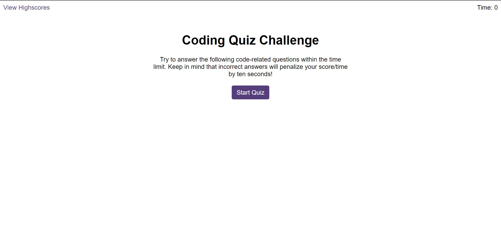

# Coding Quiz

## Description

I have created a JavaScript Fundamentals coding quiz that loops through a series of questions before displaying your final score. 

When you click the start button, the timer will start and you will see the first question. When you answer that question you will be presented with another question, and so forth until all the questions have been answered.

When you answer a question incorrectly, the timer will be decremented by 10 seconds.

WHEN all questions are answered or the timer reaches 0, the game is over and you will be presented with an end screen displaying your final score.On this page, you will be able to enter you initials and save them with your score.

I have used the following tools to create this application:

* Functions
* Event listeners on buttons
* setInterval to start the timer
* If statements
* For loops to loop through options and display all question options in individual buttons
* localStorage to save and retrieve initials and scores
* Event delegation
* JSON.stringify to convert the initials and high scores into a string to save in localStorage
* JSON.parse to retrieve string values from localStorage and convert back into objects
* Custom attributes

## Screenshot

## Links

Live application: https://zaitken1.github.io/coding-quiz/

GitHub repository: https://github.com/zaitken1/coding-quiz

